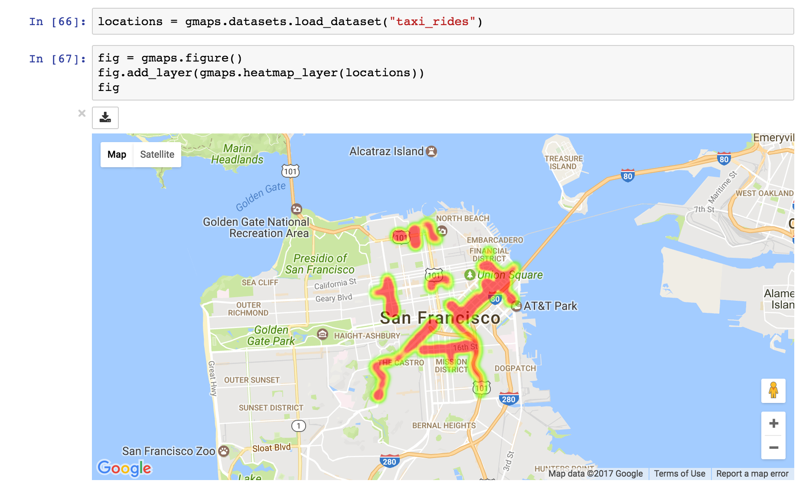
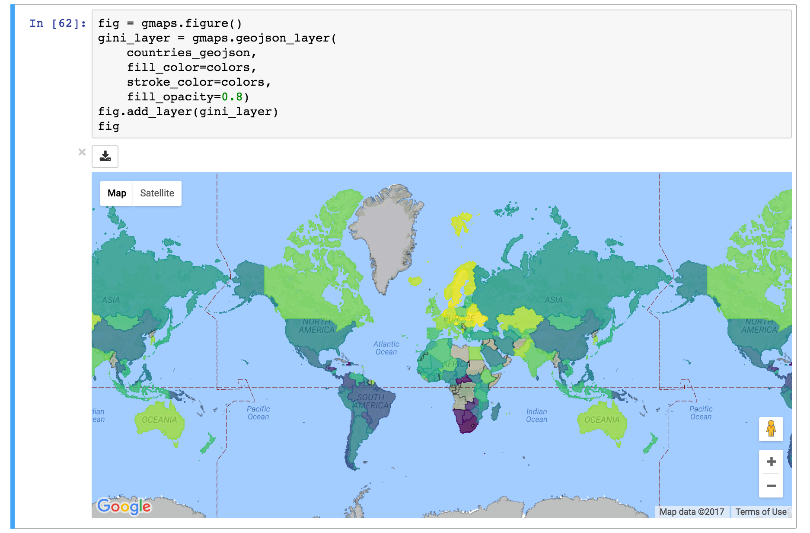
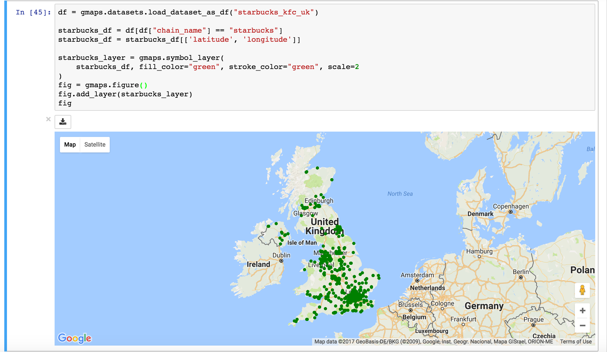

|travis| |pypi| |docs|

gmaps
=====

gmaps is a plugin for including interactive Google maps in the IPython Notebook.

Let's plot a `heatmap <http://jupyter-gmaps.readthedocs.io/en/latest/gmaps.html#heatmaps>`_ of taxi pickups in San Francisco:

.. code:: python

    In [1]: import gmaps
            import gmaps.datasets
            gmaps.configure(api_key="AI...") # Your Google API key

    # load a Numpy array of (latitude, longitude) pairs
    In [2]: locations = gmaps.datasets.load_dataset("taxi_rides")

    In [3]: fig = gmaps.figure()
            fig.add_layer(gmaps.heatmap_layer(locations))
            fig

We can also plot chloropleth maps using `GeoJSON <http://jupyter-gmaps.readthedocs.io/en/latest/gmaps.html#geojson-layer>`_:

.. code:: python

    In [1]: from matplotlib.cm import viridis
            from matplotlib.colors import to_hex
            
            import gmaps
            import gmaps.datasets
            import gmaps.geojson_geometries
            
            gmaps.configure(api_key="AI...") # Your Google API key

    In [2]: countries_geojson = gmaps.geojson_geometries.load_geometry('countries') # Load GeoJSON of countries

    In [3]: rows = gmaps.datasets.load_dataset('gini') # 'rows' is a list of tuples
            country2gini = dict(rows) # dictionary mapping 'country' -> gini coefficient
            min_gini = min(country2gini.values())
            max_gini = max(country2gini.values())
            gini_range = max_gini - min_gini

            def calculate_color(gini):
                """
                Convert the GINI coefficient to a color
                """
                # make gini a number between 0 and 1
                normalized_gini = (gini - min_gini) / gini_range

                # invert gini so that high inequality gives dark color
                inverse_gini = 1.0 - normalized_gini

                # transform the gini coefficient to a matplotlib color
                mpl_color = viridis(inverse_gini)

                # transform from a matplotlib color to a valid CSS color
                gmaps_color = to_hex(mpl_color, keep_alpha=False)

                return gmaps_color
    
            # Calculate a color for each GeoJSON feature
            colors = []
            for feature in countries_geojson['features']:
                country_name = feature['properties']['name']
                try:
                    gini = country2gini[country_name]
                    color = calculate_color(gini)
                except KeyError:
                    # no GINI for that country: return default color
                    color = (0, 0, 0, 0.3)
                colors.append(color)

      In [4]: fig = gmaps.figure()
              gini_layer = gmaps.geojson_layer(
                  countries_geojson,
                  fill_color=colors,
                  stroke_color=colors,
                  fill_opacity=0.8)
              fig.add_layer(gini_layer)
              fig

Or, for coffee fans, a map of all Starbucks in the UK:

.. code:: python

    In [1]: import gmaps
            import gmaps.datasets
            gmaps.configure(api_key="AI...") # Your Google API key

    In [2]: locations = gmaps.datasets.load_dataset("starbucks_uk")

    In [3]: fig = gmaps.Map()
            starbucks_layer = gmaps.symbol_layer(
                locations, fill_color="green", stroke_color="green", scale=2)
            fig.add_layer(starbucks_layer)
            fig

Installation
------------

Installing `gmaps` with `conda`
^^^^^^^^^^^^^^^^^^^^^^^^^^^^^^^

The easiest way to install `gmaps` is with `conda`::

    $ conda install -c conda-forge gmaps

Installing `gmaps` with `pip`
^^^^^^^^^^^^^^^^^^^^^^^^^^^^^

If you do not use conda, you can install `gmaps` with pip. The current version
of `gmaps` is only tested with *IPython 4.3* or later and *ipywidgets 7.0.0* or
later. To upgrade to the latest versions, use::

    $ pip install -U jupyter

Make sure that you have enabled widgets extensions to Jupyter::

    $ jupyter nbextension enable --py --sys-prefix widgetsnbextension

You can then install gmaps with::

    $ pip install gmaps

Then tell Jupyter to load the extension with::

    $ jupyter nbextension enable --py --sys-prefix gmaps

Google API keys
---------------

To access Google maps, `gmaps` needs a Google API key. This key tells Google who you are, presumably so it can keep track of rate limits and such things. To create an API key, follow the instructions in the `documentation <http://jupyter-gmaps.readthedocs.io/en/latest/authentication.html>`_. Once you have an API key, pass it to `gmaps` before creating widgets:

.. code:: python

    gmaps.configure(api_key="AI...")

Documentation
-------------

Documentation for `gmaps` is available `here <http://jupyter-gmaps.readthedocs.io/en/latest/>`_.

Similar libraries
-----------------

The current version of this library is inspired by the `ipyleaflet <https://github.com/ellisonbg/ipyleaflet>`_ notebook widget extension. This extension aims to provide much of the same functionality as `gmaps`, but for `leaflet maps`, not `Google maps`.

Vision and roadmap
------------------

Jupyter-gmaps is built for data scientists. Data scientists should be able to visualize geographical data on a map with minimal friction. Beyond just visualization, they should be able to integrate gmaps into their widgets so they can build interactive applications.

We see the priorities of gmaps as:

- being able to export maps (both as HTML and as rendered widgets).
- responding to events, like user clicks, so that maps can be used interactively.

Issue reporting and contributing
--------------------------------

Report issues using the `github issue tracker <https://github.com/pbugnion/gmaps/issues>`_.

Contributions are welcome. Read the CONTRIBUTING guide to learn how to contribute.

.. |travis| image:: https://travis-ci.org/pbugnion/gmaps.svg?branch=master
    :target: https://travis-ci.org/pbugnion/gmaps
    :alt: Travis build status

.. |pypi| image:: https://img.shields.io/pypi/v/gmaps.svg?style=flat-square&label=version
    :target: https://pypi.python.org/pypi/gmaps
    :alt: Latest version released on PyPi

.. |docs| image:: https://img.shields.io/badge/docs-latest-brightgreen.svg?style=flat
    :target: http://jupyter-gmaps.readthedocs.io/en/latest/
    :alt: Latest documentation
