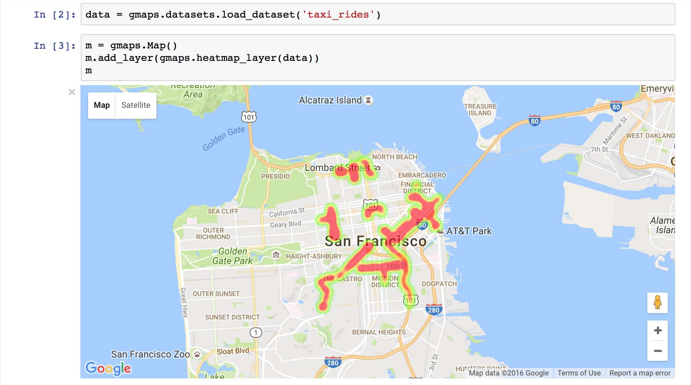

|travis| |pypi| |docs|

gmaps
=====

gmaps is a plugin for including interactive Google maps in the IPython Notebook.

Let's plot a heatmap of taxi pickups in San Francisco:

.. code:: python

    In [1]: import gmaps
            import gmaps.datasets
            gmaps.configure(api_key="AI...") # Your Google API key

    # load a Numpy array of (latitude, longitude) pairs
    In [2]: locations = gmaps.datasets.load_dataset("taxi_rides")

    In [3]: m = gmaps.Map()
            m.add_layer(gmaps.heatmap_layer(locations))
            m

Or, for coffee fans, a map of all Starbucks in the UK:

.. code:: python

    In [1]: import gmaps
            import gmaps.datasets
            gmaps.configure(api_key="AI...") # Your Google API key

    In [2]: locations = gmaps.datasets.load_dataset("starbucks_uk")

    In [3]: m = gmaps.Map()
            starbucks_layer = gmaps.symbol_layer(
                locations, fill_color="green", stroke_color="green", scale=2)
            m.add_layer(starbucks_layer)
            m

.. image:: docs/source/starbucks-symbols.png

Installation
------------

Dependencies
^^^^^^^^^^^^

The current version of `gmaps` is only tested with *IPython 4.2* or later and *ipywidgets 5.2.2* and *traitlets 4.3.0* or later. To upgrade to the latest versions, use::

    $ pip install -U jupyter

Make sure that you have enabled widgets extensions to Jupyter::

    $ jupyter nbextension enable --py --sys-prefix widgetsnbextension

Installing `gmaps`
^^^^^^^^^^^^^^^^^^

Install the Python component using::

    $ pip install gmaps

Then tell Jupyter to load the extension with::

  $ jupyter nbextension enable --py --sys-prefix gmaps

Google API keys
---------------

To access Google maps, `gmaps` needs a Google API key. This key tells Google who you are, presumably so it can keep track of rate limits and such things. To create an API key, follow the instructions in the `documentation <http://jupyter-gmaps.readthedocs.io/en/latest/authentication.html>`_. Once you have an API key, pass it to `gmaps` before creating widgets:

.. code:: python

    gmaps.configure(api_key="AI...")

Documentation
-------------

Documentation for `gmaps` is available `here <http://jupyter-gmaps.readthedocs.io/en/latest/>`_.

Similar libraries
-----------------

The current version of this library is inspired by the `ipyleaflet <https://github.com/ellisonbg/ipyleaflet>`_ notebook widget extension. This extension aims to provide much of the same functionality as `gmaps`, but for `leaflet maps`, not `Google maps`.

Vision and roadmap
------------------

Jupyter-gmaps is built for data scientists. Data scientists should be able to visualize geographical data on a map with minimal friction. Beyond just visualization, they should be able to integrate gmaps into their widgets so they can build interactive applications.

We see the priorities of gmaps as:

- being able to export maps (both as HTML and as rendered widgets).
- responding to events, like user clicks, so that maps can be used interactively.

Issue reporting and contributing
--------------------------------

Report issues using the `github issue tracker <https://github.com/pbugnion/gmaps/issues>`_.

Contributions are welcome. Read the CONTRIBUTING guide to learn how to contribute.

.. |travis| image:: https://travis-ci.org/pbugnion/gmaps.svg?branch=master
    :target: https://travis-ci.org/pbugnion/gmaps
    :alt: Travis build status

.. |pypi| image:: https://img.shields.io/pypi/v/gmaps.svg?style=flat-square&label=version
    :target: https://pypi.python.org/pypi/gmaps
    :alt: Latest version released on PyPi

.. |docs| image:: https://img.shields.io/badge/docs-latest-brightgreen.svg?style=flat
    :target: http://jupyter-gmaps.readthedocs.io/en/latest/
    :alt: Latest documentation
