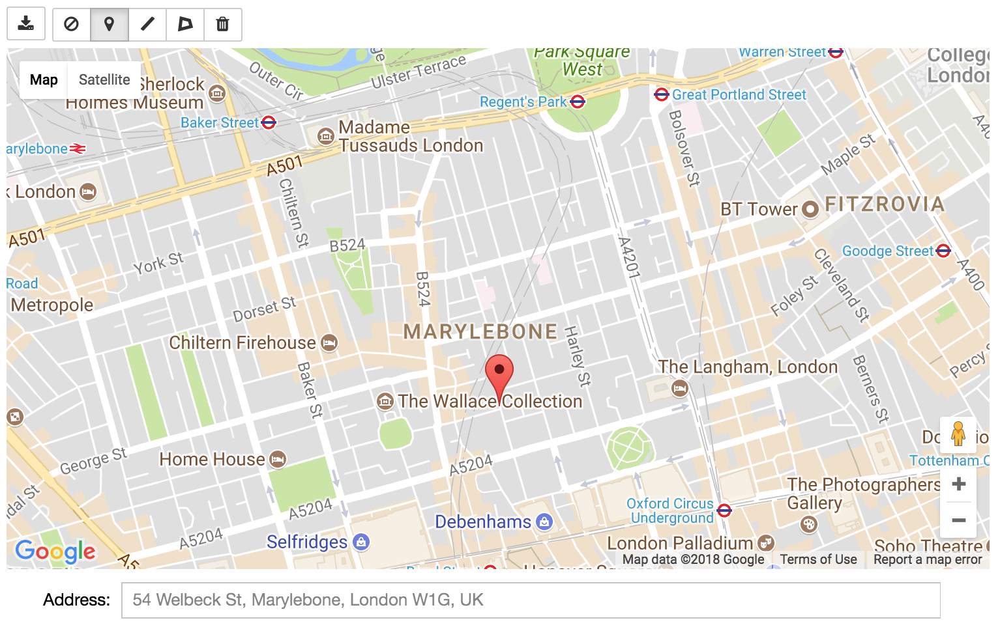
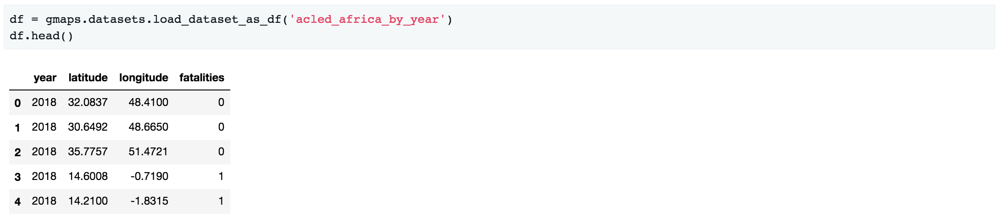
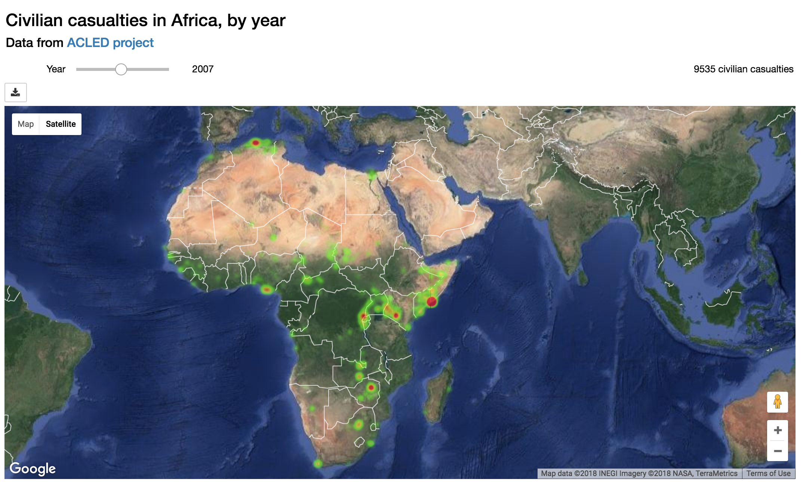

Building applications with `jupyter-gmaps`
------------------------------------------

You can use `jupyter-gmaps` as a component in a `Jupyter widgets <https://ipywidgets.readthedocs.io/en/stable/>`_ application. Jupyter widgets let you embed rich user interfaces in Jupyter notebooks. For instance:
 - you can use maps as a way to get user input. The drawing layer lets users draw markers, lines or polygons on the map. We can specify arbitrary Python code that runs whenever a shape is added to the map. As an example, we will build an application where, whenever the user places a marker, we retrieve the address of the marker and write it in a text widget. 
 - you can use maps as a way to display the result of an external computation. For instance, if you have timestamped geographical data (for instance, you have the date and coordinates of a series of events), you can combine a heatmap with a slider to see how events unfold over time.

.. _reacting-to-user-actions:

Reacting to user actions on the map
^^^^^^^^^^^^^^^^^^^^^^^^^^^^^^^^^^^

The drawing layer lets us specify Python code to be executed whenever the user
adds a feature (like a marker, a line or a polygon) to the map. To demonstrate
this, we will build a small application for *reverse geocoding*: when the user
places a marker on the map, we will find the address closest to that marker and
write it in a `text widget
<https://ipywidgets.readthedocs.io/en/stable/examples/Widget%20List.html#Text>`_.
We will use `geopy <https://pypi.python.org/pypi/geopy>`_, a wrapper around
several geocoding APIs, to calculate the address from the marker's coordinates.

This is the entire code listing::

  import ipywidgets as widgets
  import geopy
  import gmaps

  API_KEY = 'AIz...'

  gmaps.configure(api_key=API_KEY)

  class ReverseGeocoder(object):
      """
      Jupyter widget for finding addresses.

      The user places markers on a map. For each marker,
      we use `geopy` to find the nearest address to that
      marker, and write that address in a text box.
      """

      def __init__(self):
          self._figure = gmaps.figure()
          self._drawing = gmaps.drawing_layer()
          self._drawing.on_new_feature(self._new_feature_callback)
          self._figure.add_layer(self._drawing)
          self._address_box = widgets.Text(
              description='Address: ',
              disabled=True,
              layout={'width': '95%', 'margin': '10px 0 0 0'}
          )
          self._geocoder = geopy.geocoders.GoogleV3(api_key=API_KEY)
          self._container = widgets.VBox([self._figure, self._address_box])

      def _get_location_details(self, location):
          return self._geocoder.reverse(location, exactly_one=True)

      def _clear_address_box(self):
          self._address_box.value = ''

      def _show_address(self, location):
          location_details = self._get_location_details(location)
          if location_details is None:
              self._address_box.value = 'No address found'
          else:
              self._address_box.value = location_details.address

      def _new_feature_callback(self, feature):
          try:
              location = feature.location
          except AttributeError:
              return # Not a marker

          # Clear address box to signify to the user that something is happening
          self._clear_address_box()

          # Remove all markers other than the one that has just been added.
          self._drawing.features = [feature]

          # Compute the address and display it
          self._show_address(location)

      def render(self):
          return self._container

  ReverseGeocoder().render()

There are several things to note:

- We wrap the application in a ``ReverseGeocoder`` class. Wrapping your
  application in a class (rather than using the notebook's global namespace)
  helps with encapsulation and lets you instantiate this widget multiple times.
  Since the flow through widget applications is often more complex than linear
  data analysis workflows, encapsulation will improve your ability to reason
  about the code.
- As part of the class constructor, we use :func:`gmaps.figure` to create a
  figure. We then use :func:`gmaps.drawing_layer` to create a drawing layer,
  which we add to the figure. We also create a ``widgets.Text`` widget. This is
  a text box in which we will write the address. We then wrap our figure and the
  text box in a single ``widgets.VBox``, a widget container that stacks widgets
  vertically.
- We register a callback on the drawing layer using ``.on_new_feature``. The
  function that we pass in to ``.on_new_feature`` will get called whenever the
  user adds a feature to the map. This is the hook that lets us build complex
  applications on top of the drawing layer: we can run arbitrary Python code
  when the user adds a marker to the map.
- In the ``.on_new_feature`` callback, we first check whether the feature that
  has been added is a marker (the user could, in principle, have added another
  feature type, like a line, to the map).
- Assuming the feature is a valid marker, we first clear the text widget
  containing the address. This gives feedback to the user that something is
  happening.
- We then re-write the ``.features`` array of the drawing layer, keeping just
  the marker that the user has just added. This clears previous markers,
  avoiding clutter on the map.
- We then use `geopy <https://pypi.python.org/pypi/geopy>`_ to find the
  adddress. Assuming the address is valid, display it in the text widget.

Updating data in response to other widgets
^^^^^^^^^^^^^^^^^^^^^^^^^^^^^^^^^^^^^^^^^^

Many layers support updating the data without re-rendering the entire map. This is useful
for exploring multi-dimensional datasets, especially in conjunction with other widgets.

As an example, we will use the ``acled_africa_by_year`` dataset, a dataset
indexing violence against civilians in Africa. The original dataset is from the
`ACLED project <https://www.acleddata.com/data/>`_. The dataset has four
columns::

  import gmaps.datasets

  df = gmaps.datasets.load_dataset_as_df('acled_africa_by_year')
  df.head()

We will build an application that lets the user explore different years via a slider. When
the user changes the slider, we display the total number of fatalities for that year,
and update a heatmap showing the distribution of conflicts.

This is the entire code listing::

  from IPython.display import display
  import ipywidgets as widgets

  import gmaps
  gmaps.configure(api_key='AIza...')

  class AcledExplorer(object):
      """
      Jupyter widget for exploring the ACLED dataset.

      The user uses the slider to choose a year. This renders
      a heatmap of civilian victims in that year.
      """

      def __init__(self, df):
          self._df = df
          self._heatmap = None
          self._slider = None
          initial_year = min(self._df['year'])

          title_widget = widgets.HTML(
              '<h3>Civilian casualties in Africa, by year</h3>'
              '<h4>Data from <a href="https://www.acleddata.com/">ACLED project</a></h4>'
          )

          map_figure = self._render_map(initial_year)
          controls = self._render_controls(initial_year)
          self._container = widgets.VBox([title_widget, controls, map_figure])

      def render(self):
          display(self._container)

      def _on_year_change(self, change):
          year = self._slider.value
          self._heatmap.locations = self._locations_for_year(year)
          self._total_box.value = self._total_casualties_text_for_year(year)
          return self._container

      def _render_map(self, initial_year):
          fig = gmaps.figure()
          self._heatmap = gmaps.heatmap_layer(
              self._locations_for_year(initial_year),
              max_intensity=100,
              point_radius=8
          )
          fig.add_layer(self._heatmap)
          return fig

      def _render_controls(self, initial_year):
          self._slider = widgets.IntSlider(
              value=initial_year,
              min=min(self._df['year']),
              max=max(self._df['year']),
              description='Year',
              continuous_update=False
          )
          self._total_box = widgets.Label(
              value=self._total_casualties_text_for_year(initial_year)
          )
          self._slider.observe(self._on_year_change, names='value')
          controls = widgets.HBox(
              [self._slider, self._total_box], 
              layout={'justify_content': 'space-between'}
          )
          return controls

      def _locations_for_year(self, year):
          return self._df[self._df['year'] == year][['latitude', 'longitude']]

      def _total_casualties_for_year(self, year):
          return int(self._df[self._df['year'] == year]['year'].count())

      def _total_casualties_text_for_year(self, year):
          return '{} civilian casualties'.format(self._total_casualties_for_year(year))

  AcledExplorer(df).render()

  
There are several things to note on this:

- We wrap the application in a class to help keep the mutable state
  encapsulated.
- As part of the class constructor, we use :func:`gmaps.figure` to create a
  figure. We add use :func:`gmaps.heatmap_layer` to create a heatmap, which we
  add to the figure. The :class:`Heatmap` object returned has a ``locations``
  attribute. Setting this to a new value will automatically update the heatmap.
- We create a slider with ``widgets.IntSlider``. In general, `jupyter-gmaps`
  objects are designed to interact with widgets from ipywidgets. For a full list
  of available widgets, see the `ipywidgets documentation
  <https://ipywidgets.readthedocs.io/en/latest/examples/Widget%20List.html>`_.
- We want to react to changes in the slider: every time the slider moves, we
  recompute the total number of fatalities and update the data in the heatmap.
  To react to changes in a widget, we use the ``.observe`` method on the widget.
  This lets us specify a callback that gets called whenever a given attribute of
  the widget changes. We pass the ``names="value"`` argument to
  ``slider.observe`` to only react to changes in the slider's ``value``
  attribute. Note that the callback (``self.render`` in our case) needs to take
  a single argument. It gets passed a dictionary describing the change.
- To build the layout for our application, we use combinations of `HBox
  <https://ipywidgets.readthedocs.io/en/latest/examples/Widget%20List.html#HBox>`_
  and `VBox
  <https://ipywidgets.readthedocs.io/en/latest/examples/Widget%20List.html#VBox>`_
  widgets.
