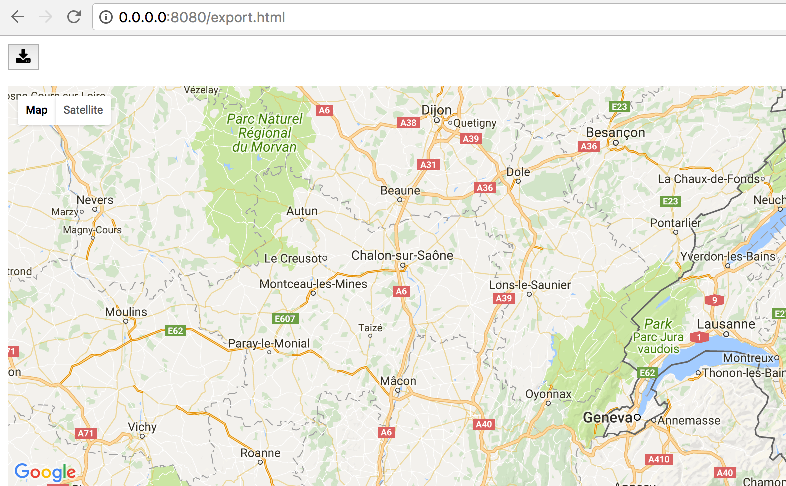

Exporting maps
--------------

Exporting to PNG
^^^^^^^^^^^^^^^^

You can save maps to PNG by clicking the `Download` button in the toolbar.
This will download a static copy of the map.

This feature suffers from some know issues:

 - there is no way to set the quality of the rendering at present,
 - you cannot export maps that contain a `Directions` layer (see `the issue <https://github.com/pbugnion/gmaps/issues/144>`_ on Github for details).

Exporting to HTML
^^^^^^^^^^^^^^^^^

You can export maps to HTML using the infrastructure provided by
`ipywidgets`. For instance, let's export a simple map to HTML::

    from ipywidgets.embed import embed_minimal_html
    import gmaps

    gmaps.configure(api_key="AI...")

    fig = gmaps.figure()
    embed_minimal_html('export.html', views=[fig])

This generates a file, ``export.html``, with two (or more) ``<script>`` tags
that contain the widget state. The scripts with tag ``<script
type="application/vnd.jupyter.widget-view+json">`` indicate where the
widgets will be placed in the DOM. You can move these around and nest them
in other DOM elements to change where the exported maps appear in the DOM.

Open ``export.html`` with a webserver, e.g. by running, if you use Python 3::

    python -m http.server 8080

Or, if you use Python 2::

    python -m SimpleHTTPServer 8080

Navigate to `http://0.0.0.0:8080/export.html` and you should see the export!

The module ``ipywidgets.embed`` contains other functions for exporting that
will give you greater control over what is exported. See the `documentation
<https://ipywidgets.readthedocs.io/en/latest/embedding.html#python-interface>`_
and the `source code
<https://github.com/jupyter-widgets/ipywidgets/blob/master/ipywidgets/embed.py>`_
for more details.
