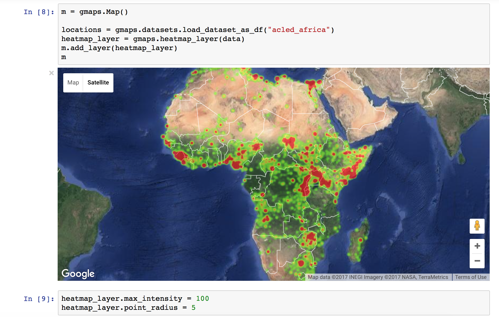
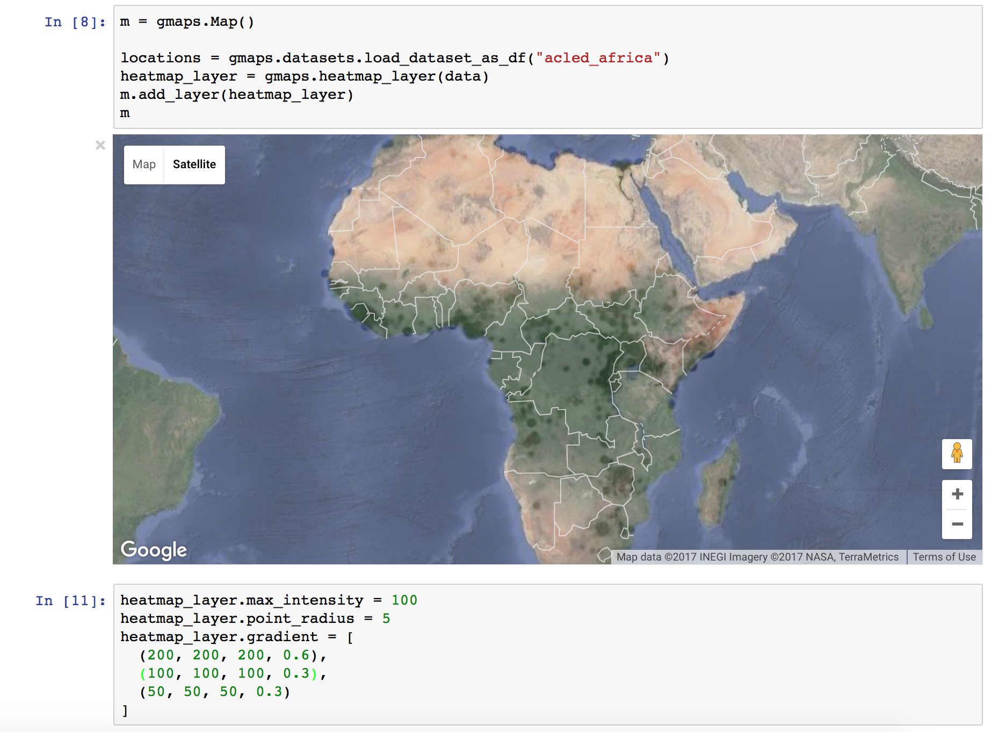
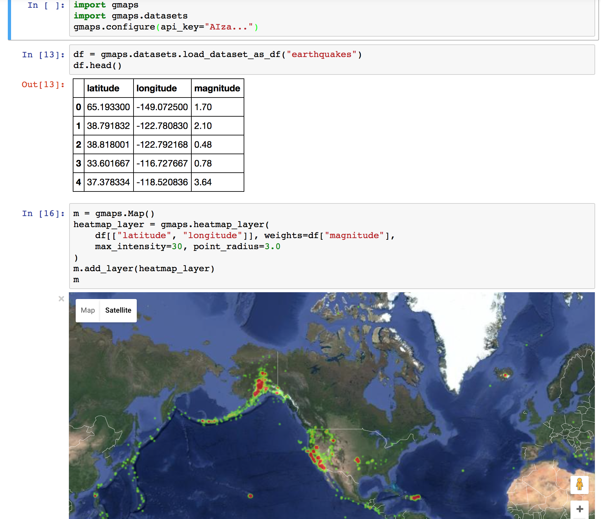
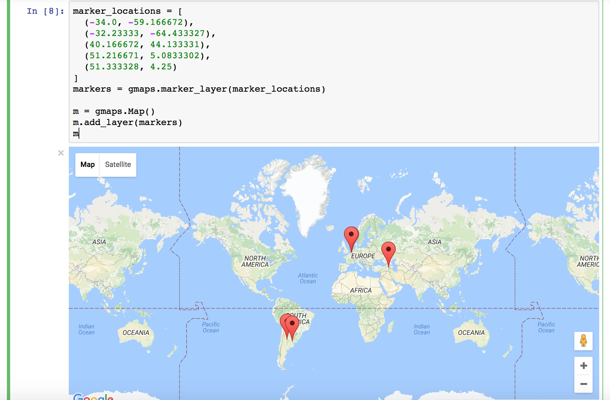
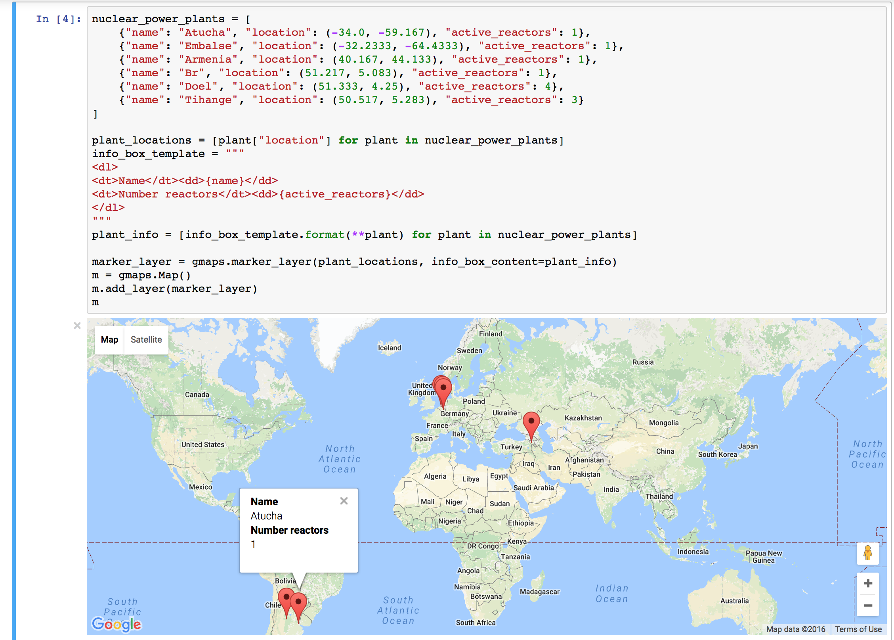
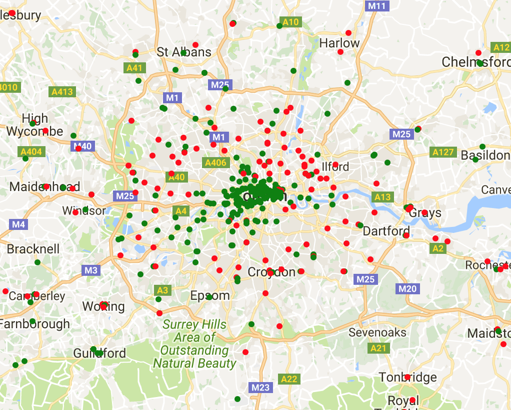

Getting started
---------------

`gmaps` is a plugin for Jupyter for embedding Google Maps in your notebooks. It is designed as a data visualization tool.

To demonstrate `gmaps`, let's plot the earthquake dataset, included in the package::

  import gmaps
  import gmaps.datasets

  gmaps.configure(api_key="AI...") # Fill in with your API key

  earthquake_data = gmaps.datasets.load_dataset("earthquakes")

  print(earthquake_data[:4]) # first four rows

The earthquake data is a list of triples: a latitude and longitude indicating the earthquake's epicentre and a weight denoting the magnitude of the earthquake at that point. Let's plot the earthquakes on a Google map::

  m = gmaps.Map()
  m.add_layer(gmaps.WeightedHeatmap(data=earthquake_data))
  m

.. image:: tutorial-earthquakes.*

This gives you a fully-fledged Google map. You can zoom in and out, switch to satellite view and even to street view if you really want. The heatmap adjusts as you zoom in and out.

Basic concepts
^^^^^^^^^^^^^^

`gmaps` is built around the idea of adding layers to a base map. After you've `authenticated <authentication.html>`_ with Google maps, you start by creating a base map::

  import gmaps
  gmaps.configure(api_key="AI...")

  m = gmaps.Map()
  m

.. image:: plainmap2.*

You then add layers on top of the base map. For instance, to add a heatmap layer::

  import gmaps
  gmaps.configure(api_key="AI...")

  m = gmaps.Map()

  # generate some data
  data = [(51.5, 0.1), (51.7, 0.2), (51.4, -0.2), (51.49, 0.1)]

  heatmap_layer = gmaps.Heatmap(data=data)
  m.add_layer(heatmap_layer)
  m

.. image:: plainmap3.*

Attributes on the base map and the layers can be set through named arguments in the constructor or as instance attributes once the instance is created. These two constructions are thus equivalent::

  heatmap_layer = gmaps.Heatmap(data=data)
  heatmap_layer.point_radius = 8

and::

  heatmap_layer = gmaps.Heatmap(data=data, point_radius=8)

The former construction is useful for modifying a map once it has been built. Any change in parameters will propagate to maps in which those layers are included.

Heatmaps
^^^^^^^^

Heatmaps are a good way of getting a sense of the density and clusters of geographical events. They are a powerful tool for making sense of larger datasets. We will use a dataset recording all instances of political violence that occurred in Africa between 1997 and 2015. The dataset comes from the `Armed Conflict Location and Event Data Project <http://www.acleddata.com>`_. This dataset contains about 110,000 rows.::

  import gmaps.datasets

  data = gmaps.datasets.load_dataset("acled_africa.csv")
  print(rows[:10])

  # => prints latitude, longitude pairs
  [(36.4686, 2.8289),
  (36.6725, 2.7894),
  ...

We already know how to build a heatmap layer::

  import gmaps
  import gmaps.datasets
  gmaps.configure("AI...")

  m = gmaps.Map()
  heatmap_layer = gmaps.Heatmap(data=data)
  m.add_layer(heatmap_layer)
  m

Preventing dissipation on zoom
++++++++++++++++++++++++++++++

If you zoom in sufficiently, you will notice that individual points disappear. You can prevent this from happening by controlling the ``max_intensity`` setting. This caps off the maximum peak intensity. It is useful if your data is strongly peaked. This settings is `None` by default, which implies no capping. Typically, when setting the maximum intensity, you also want to set the ``point_radius`` setting to a fairly low value. The only good way to find reasonable values for these settings is to tweak them until you have a map that you are happy with.::

  heatmap_layer.max_intensity = 100
  heatmap_layer.point_radius = 5

To avoid re-drawing the whole map every time you tweak these settings, you may want to set them in another noteobook cell:

Google maps also exposes a ``dissipating`` option, which is true by default. If this is true, the radius of influence of each point is tied to the zoom level: as you zoom out, a given point covers more physical kilometres. If you set it to false, the physical radius covered by each point stays fixed. Your points will therefore either be tiny at high zoom levels or large at low zoom levels.

Setting the color gradient and opacity
++++++++++++++++++++++++++++++++++++++

You can set the color gradient of the map by passing in a list of colors. Google maps will interpolate linearly between those colors. You can represent a color as a string denoting the color (the colors allowed by `this <http://www.w3.org/TR/css3-color/#html4>`_)::

  heatmap.gradient = [
      'white',
      'silver',
      'gray'
  ]

If you need more flexibility, you can represent colours as an RGB triple or an RGBA quadruple::

  heatmap.gradient = [
      (200, 200, 200, 0.6),
      (100, 100, 100, 0.3),
      (50, 50, 50, 0.3)
  ]

You can also use the ``opacity`` option to set a single opacity across the entire colour gradient::

  heatmap.opacity = 0.0 # make the heatmap transparent

Weighted heatmaps
^^^^^^^^^^^^^^^^^

Weighted heatmap layers are identical to heatmaps, except that the `data` object is a triple indicating `(latitude, longitude, weight)`. Weights must all be positive (this is a limitation in Google maps itself).

Weighted heatmaps support the same options as heatmaps.

Markers and symbols
^^^^^^^^^^^^^^^^^^^

We can add a layer of markers to a Google map. Each marker represents an individual data point::

  import gmaps
  gmaps.configure(api_key="AI...")

  marker_locations = [
      (-34.0, -59.166672),
      (-32.23333, -64.433327),
      (40.166672, 44.133331),
      (51.216671, 5.0833302),
      (51.333328, 4.25)
  ]
  markers = gmaps.marker_layer(marker_locations)

  m = gmaps.Map()
  m.add_layer(markers)
  m

We can also attach a pop-up box to each marker. Clicking on the marker will bring up the info box. The content of the box can be either plain text or html::

  import gmaps
  gmaps.configure(api_key="AI...")

  nuclear_power_plants = [
      {"name": "Atucha", "location": (-34.0, -59.167), "active_reactors": 1},
      {"name": "Embalse", "location": (-32.2333, -64.4333), "active_reactors": 1},
      {"name": "Armenia", "location": (40.167, 44.133), "active_reactors": 1},
      {"name": "Br", "location": (51.217, 5.083), "active_reactors": 1},
      {"name": "Doel", "location": (51.333, 4.25), "active_reactors": 4},
      {"name": "Tihange", "location": (50.517, 5.283), "active_reactors": 3}
  ]

  plant_locations = [plant["location"] for plant in nuclear_power_plants]
  info_box_template = """
  <dl>
  <dt>Name</dt><dd>{name}</dd>
  <dt>Number reactors</dt><dd>{active_reactors}</dd>
  </dl>
  """
  plant_info = [info_box_template.format(**plant) for plant in nuclear_power_plants]

  marker_layer = gmaps.marker_layer(plant_locations, info_box_content=plant_info)
  m = gmaps.Map()
  m.add_layer(marker_layer)
  m

Markers are currently limited to the Google maps style drop icon. If you need to draw more complex shape on maps, use the ``symbol_layer`` function. Symbols represent each `latitude`, `longitude` pair with a circle whose colour and size you can customize. Let's, for instance, plot the location of every Starbuck's coffee shop in the UK::

    import gmaps
    import gmaps.datasets

    gmaps.configure(api_key="AI...")

    starbucks_locations = gmaps.datasets.load_dataset("starbucks_uk")
    starbucks_layer = gmaps.symbol_layer(
        starbucks_locations, fill_color="green", stroke_color="green", scale=2
    )
    m = gmaps.Map()
    m.add_layer(starbucks_layer)
    m

.. image:: starbucks-symbols.png

You can have several layers of markers. For instance, we can compare the locations of Starbucks coffee shops and KFC outlets in the UK by plotting both on the same map::

    import gmaps
    import gmaps.datasets

    gmaps.configure(api_key="AI...")

    starbucks_locations = gmaps.datasets.load_dataset("starbucks_uk")
    kfc_locations = gmaps.datasets.load_dataset("kfc_uk")
    starbucks_layer = gmaps.symbol_layer(
        starbucks_locations, fill_color="green", stroke_color="green", scale=2
    )
    kfc_layer = gmaps.symbol_layer(
        kfc_locations, fill_color="red", stroke_color="red", scale=2
    )
    m = gmaps.Map()
    m.add_layer(starbucks_layer)
    m.add_layer(kfc_layer)
    m

Dataset size limitations
++++++++++++++++++++++++

Google maps may become very slow if you try to represent more than a few thousand symbols or markers. If you have a larger dataset, you should either consider subsampling or use heatmaps.
