Getting started
---------------

`gmaps` is a plugin for Jupyter for embedding Google Maps in your notebooks. It is designed as a data visualization tool.

To demonstrate `gmaps`, let's plot the earthquake dataset, included in the package::

  import gmaps
  import gmaps.datasets

  gmaps.configure(api_key="AI...") # Fill in with your API key

  earthquake_df = gmaps.datasets.load_dataset_as_df("earthquakes")
  earthquake_df.head()

The earthquake data has three columns: a latitude and longitude indicating the earthquake's epicentre and a weight denoting the magnitude of the earthquake at that point. Let's plot the earthquakes on a Google map::

  locations = earthquake_df[["latitude", "longitude"]]
  weights = earthquake_df["magnitude"]
  fig = gmaps.figure()
  fig.add_layer(gmaps.heatmap_layer(locations, weights=weights))
  fig

.. image:: _images/tutorial-earthquakes.*

This gives you a fully-fledged Google map. You can zoom in and out, switch to satellite view and even to street view if you really want. The heatmap adjusts as you zoom in and out.

Basic concepts
^^^^^^^^^^^^^^

`gmaps` is built around the idea of adding layers to a base map. After you've `authenticated <authentication.html>`_ with Google maps, you start by creating a figure, which contains a base map::

  import gmaps
  gmaps.configure(api_key="AI...")

  fig = gmaps.figure()
  fig

.. image:: _images/plainmap2.*

You then add layers on top of the base map. For instance, to add a heatmap layer::

  import gmaps
  gmaps.configure(api_key="AI...")

  fig = gmaps.figure()

  # generate some (latitude, longitude) pairs
  locations = [(51.5, 0.1), (51.7, 0.2), (51.4, -0.2), (51.49, 0.1)]

  heatmap_layer = gmaps.heatmap_layer(locations)
  fig.add_layer(heatmap_layer)
  fig

.. image:: _images/plainmap3.*

The `locations` array can either be a list of tuples, as in the example above, a numpy array of shape $N \times 2$ or a dataframe with two columns.

Most attributes on the base map and the layers can be set through named arguments in the constructor or as instance attributes once the instance is created. These two constructions are thus equivalent::

  heatmap_layer = gmaps.heatmap_layer(locations)
  heatmap_layer.point_radius = 8

and::

  heatmap_layer = gmaps.heatmap_layer(locations, point_radius=8)

The former construction is useful for modifying a map once it has been built. Any change in parameters will propagate to maps in which those layers are included.

Base maps
^^^^^^^^^

Your first action with `gmaps` will usually be to build a base map::

  import gmaps
  gmaps.configure(api_key="AI...")

  gmaps.figure()

This builds an empty map. You can also set the zoom level and map center
explicitly::

  new_york_coordinates = (40.75, -74.00)
  gmaps.figure(center=new_york_coordinates, zoom_level=12)

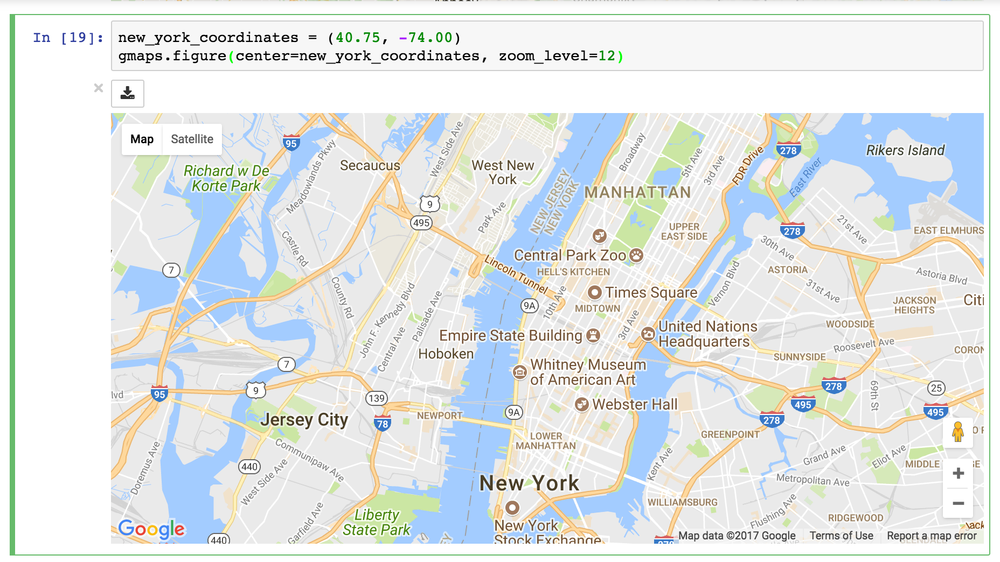

If you do not set the map zoom and center, the viewport will automatically
focus on the data as you add it to the map.

Customising map width, height and layout
^^^^^^^^^^^^^^^^^^^^^^^^^^^^^^^^^^^^^^^^

The layout of a map figure is controlled by passing a `layout
<https://ipywidgets.readthedocs.io/en/latest/examples/Widget%20Styling.html>`_
argument. This is a dictionary of properties controlling how the widget is
displayed::

  import gmaps
  gmaps.configure(api_key="AI...")

  figure_layout = {
      'width': '400px',
      'height': '400px',
      'border': '1px solid black',
      'padding': '1px'
  }
  gmaps.figure(layout=figure_layout)

.. image:: _images/figure_layout1.png

The parameters that you are likely to want to tweak are:

 - `width`: controls the figure width. This should be a `CSS dimension
   <https://developer.mozilla.org/en-US/docs/Web/CSS/width>`_. For instance,
   ``400px`` will create a figure that is 400 pixels wide, while ``100%`` will
   create a figure that takes up the output cell's entire width. The default
   width is ``100%``.
 - `height`: controls the figure height. This should be a `CSS dimension
   <https://developer.mozilla.org/en-US/docs/Web/CSS/width>`_. The default
   height is ``420px``.
 - `border`: Place a border around the figure. This should be a valid
   `CSS border <https://developer.mozilla.org/en-US/docs/Web/CSS/border>`_.
 - `padding`: Gap between the figure and the border. This should be a valid `CSS
   padding <https://developer.mozilla.org/en-US/docs/Web/CSS/padding>`_. You can
   either have a single dimension (e.g. ``2px``), or a quadruple indicating the
   padding width for each side (e.g. ``1px 2px 1px 2px``). This is ``0`` by
   default.
 - `margin`: Gap between the border and the figure container. This should be a
   valid `CSS margin <https://developer.mozilla.org/en-US/docs/Web/CSS/margin>`_.
   This is ``0`` by default.

To center a map in an output cell, use a fixed width and set the left and right margins to ``auto``::

  figure_layout = {'width': '500px', 'margin': '0 auto 0 auto'}
  gmaps.figure(layout=figure_layout)

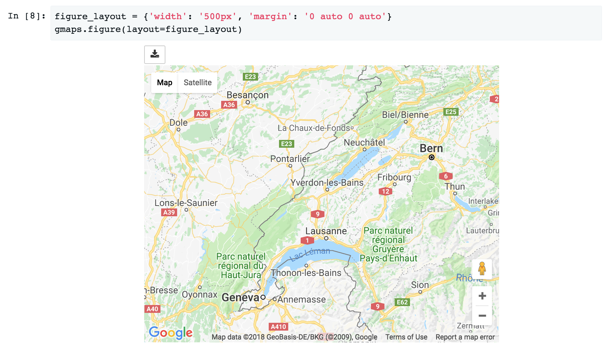

Heatmaps
^^^^^^^^

Heatmaps are a good way of getting a sense of the density and clusters of geographical events. They are a powerful tool for making sense of larger datasets. We will use a dataset recording all instances of political violence that occurred in Africa between 1997 and 2015. The dataset comes from the `Armed Conflict Location and Event Data Project <http://www.acleddata.com>`_. This dataset contains about 110,000 rows.

::

  import gmaps.datasets

  locations = gmaps.datasets.load_dataset_as_df("acled_africa")

  locations.head()
  # => dataframe with 'longitude' and 'latitude' columns

We already know how to build a heatmap layer::

  import gmaps
  import gmaps.datasets
  gmaps.configure(api_key="AI...")

  locations = gmaps.datasets.load_dataset_as_df("acled_africa")
  fig = gmaps.figure()
  heatmap_layer = gmaps.heatmap_layer(locations)
  fig.add_layer(heatmap_layer)
  fig

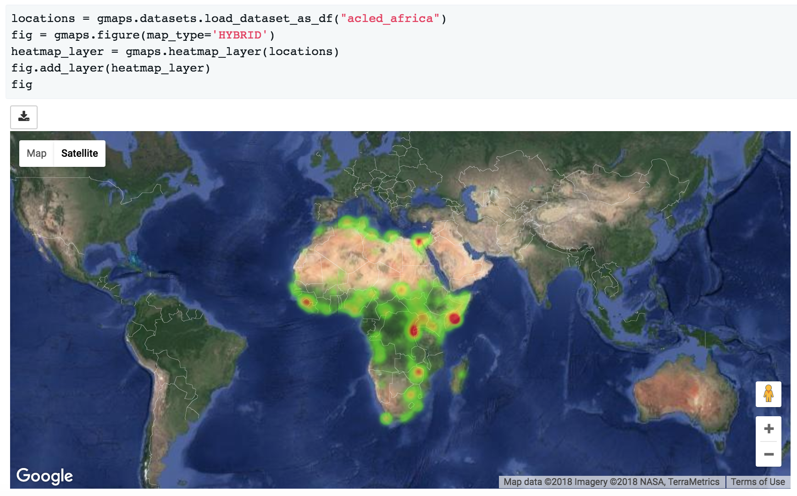

Preventing dissipation on zoom
++++++++++++++++++++++++++++++

If you zoom in sufficiently, you will notice that individual points disappear. You can prevent this from happening by controlling the ``max_intensity`` setting. This caps off the maximum peak intensity. It is useful if your data is strongly peaked. This settings is `None` by default, which implies no capping. Typically, when setting the maximum intensity, you also want to set the ``point_radius`` setting to a fairly low value. The only good way to find reasonable values for these settings is to tweak them until you have a map that you are happy with.::

  heatmap_layer.max_intensity = 100
  heatmap_layer.point_radius = 5

To avoid re-drawing the whole map every time you tweak these settings, you may want to set them in another noteobook cell:

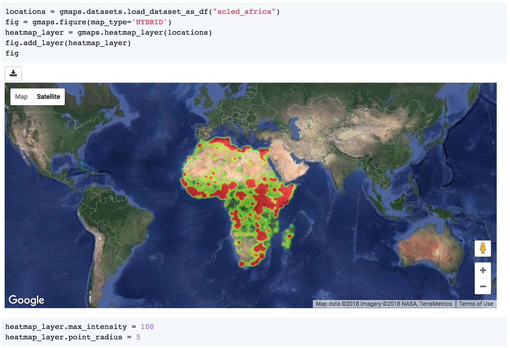

Google maps also exposes a ``dissipating`` option, which is true by default. If this is true, the radius of influence of each point is tied to the zoom level: as you zoom out, a given point covers more physical kilometres. If you set it to false, the physical radius covered by each point stays fixed. Your points will therefore either be tiny at high zoom levels or large at low zoom levels.

Setting the color gradient and opacity
++++++++++++++++++++++++++++++++++++++

You can set the color gradient of the map by passing in a list of colors. Google maps will interpolate linearly between those colors. You can represent a color as a string denoting the color (the colors allowed by `this <http://www.w3.org/TR/css3-color/#html4>`_)::

  heatmap_layer.gradient = [
      'white',
      'silver',
      'gray'
  ]

If you need more flexibility, you can represent colours as an RGB triple or an RGBA quadruple::

  heatmap_layer.gradient = [
      (200, 200, 200, 0.6),
      (100, 100, 100, 0.3),
      (50, 50, 50, 0.3)
  ]

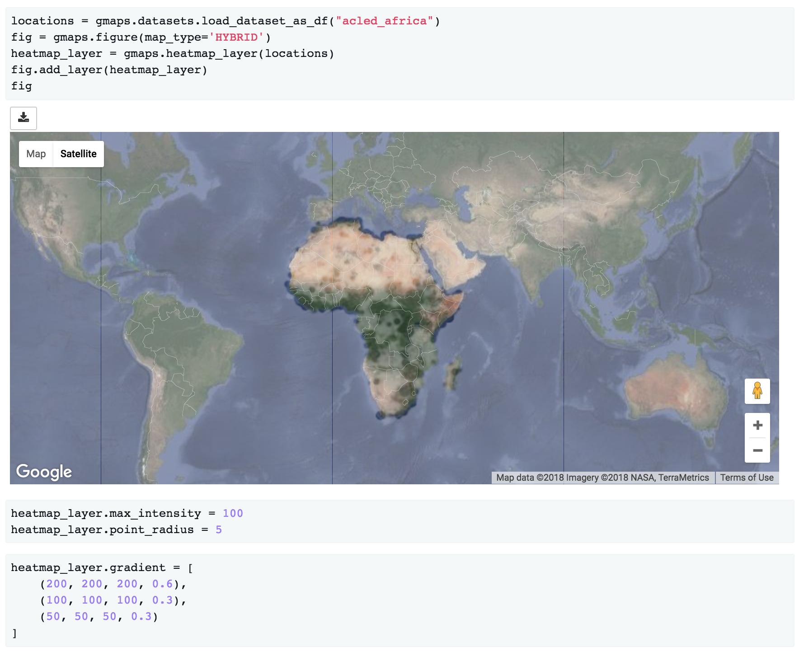

You can also use the ``opacity`` option to set a single opacity across the entire colour gradient::

  heatmap_layer.opacity = 0.0 # make the heatmap transparent

Weighted heatmaps
^^^^^^^^^^^^^^^^^

By default, heatmaps assume that every row is of equal importance. You can override this by passing weights through the `weights` keyword argument. The `weights` array is an iterable (e.g. a Python list or a Numpy array) or a single pandas series. Weights must all be positive (this is a limitation in Google maps itself).

::

  import gmaps
  import gmaps.datasets
  gmaps.configure(api_key="AI...")

  df = gmaps.datasets.load_dataset_as_df("earthquakes")
  # dataframe with columns ('latitude', 'longitude', 'magnitude')

  fig = gmaps.figure()
  heatmap_layer = gmaps.heatmap_layer(
      df[["latitude", "longitude"]], weights=df["magnitude"],
      max_intensity=30, point_radius=3.0 
  )
  fig.add_layer(heatmap_layer)
  fig

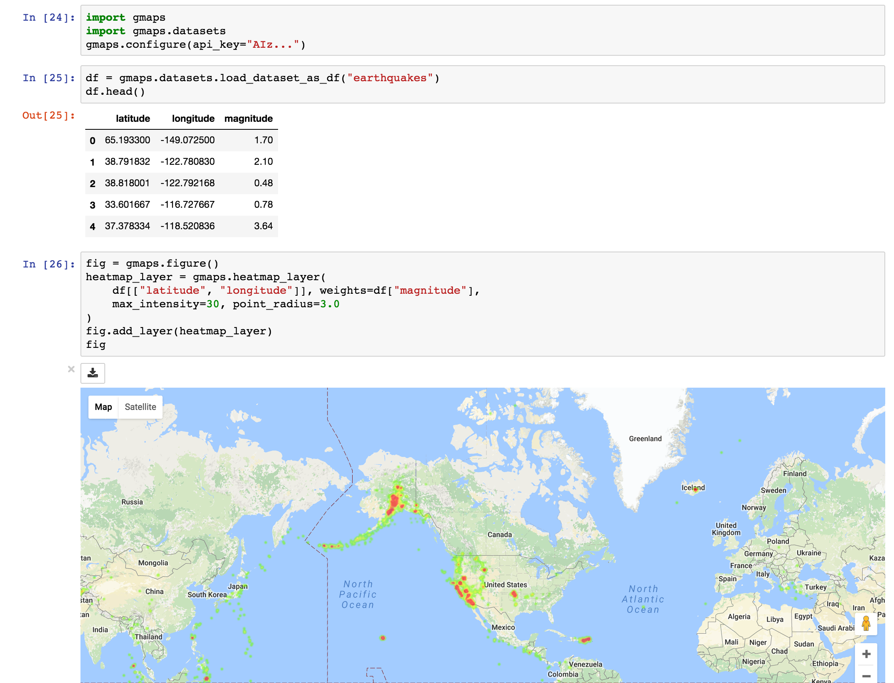

Markers and symbols
^^^^^^^^^^^^^^^^^^^

We can add a layer of markers to a Google map. Each marker represents an individual data point::

  import gmaps
  gmaps.configure(api_key="AI...")

  marker_locations = [
      (-34.0, -59.166672),
      (-32.23333, -64.433327),
      (40.166672, 44.133331),
      (51.216671, 5.0833302),
      (51.333328, 4.25)
  ]

  fig = gmaps.figure()
  markers = gmaps.marker_layer(marker_locations)
  fig.add_layer(markers)
  fig

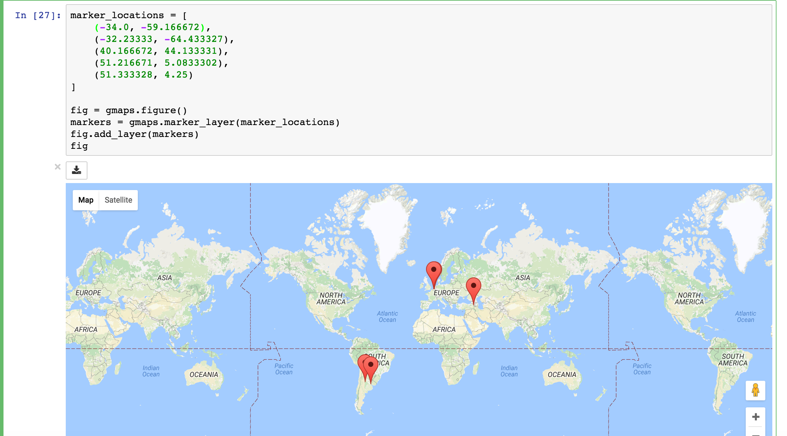

We can also attach a pop-up box to each marker. Clicking on the marker will bring up the info box. The content of the box can be either plain text or html::

  import gmaps
  gmaps.configure(api_key="AI...")

  nuclear_power_plants = [
      {"name": "Atucha", "location": (-34.0, -59.167), "active_reactors": 1},
      {"name": "Embalse", "location": (-32.2333, -64.4333), "active_reactors": 1},
      {"name": "Armenia", "location": (40.167, 44.133), "active_reactors": 1},
      {"name": "Br", "location": (51.217, 5.083), "active_reactors": 1},
      {"name": "Doel", "location": (51.333, 4.25), "active_reactors": 4},
      {"name": "Tihange", "location": (50.517, 5.283), "active_reactors": 3}
  ]

  plant_locations = [plant["location"] for plant in nuclear_power_plants]
  info_box_template = """
  <dl>
  <dt>Name</dt><dd>{name}</dd>
  <dt>Number reactors</dt><dd>{active_reactors}</dd>
  </dl>
  """
  plant_info = [info_box_template.format(**plant) for plant in nuclear_power_plants]

  marker_layer = gmaps.marker_layer(plant_locations, info_box_content=plant_info)
  fig = gmaps.figure()
  fig.add_layer(marker_layer)
  fig

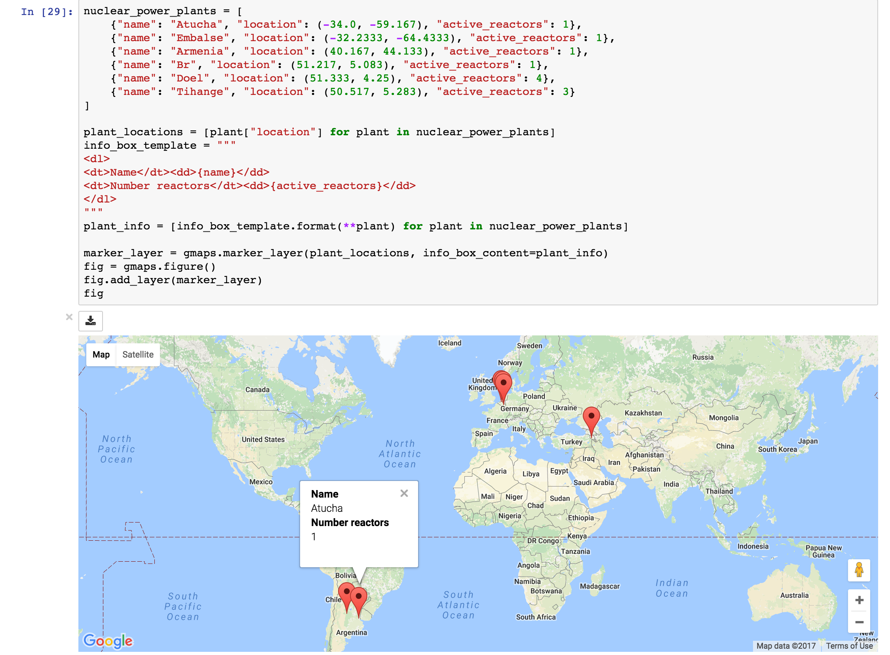

Markers are currently limited to the Google maps style drop icon. If you need to draw more complex shape on maps, use the ``symbol_layer`` function. Symbols represent each `latitude`, `longitude` pair with a circle whose colour and size you can customize. Let's, for instance, plot the location of every Starbuck's coffee shop in the UK::

    import gmaps
    import gmaps.datasets

    gmaps.configure(api_key="AI...")

    df = gmaps.datasets.load_dataset_as_df("starbucks_kfc_uk")

    starbucks_df = df[df["chain_name"] == "starbucks"]
    starbucks_df = starbucks_df[['latitude', 'longitude']]                

    starbucks_layer = gmaps.symbol_layer(
        starbucks_df, fill_color="green", stroke_color="green", scale=2
    )
    fig = gmaps.figure()
    fig.add_layer(starbucks_layer)
    fig

.. image:: _images/starbucks-symbols.png

You can have several layers of markers. For instance, we can compare the locations of Starbucks coffee shops and KFC outlets in the UK by plotting both on the same map::

    import gmaps
    import gmaps.datasets

    gmaps.configure(api_key="AI...")

    df = gmaps.datasets.load_dataset_as_df("starbucks_kfc_uk")

    starbucks_df = df[df["chain_name"] == "starbucks"]
    starbucks_df = starbucks_df[['latitude', 'longitude']]                

    kfc_df = df[df["chain_name"] == "kfc"]
    kfc_df = kfc_df[['latitude', 'longitude']]

    starbucks_layer = gmaps.symbol_layer(
        starbucks_df, fill_color="rgba(0, 150, 0, 0.4)", 
        stroke_color="rgba(0, 150, 0, 0.4)", scale=2
    )

    kfc_layer = gmaps.symbol_layer(
        kfc_df, fill_color="rgba(200, 0, 0, 0.4)", 
        stroke_color="rgba(200, 0, 0, 0.4)", scale=2
    )

    fig = gmaps.figure()
    fig.add_layer(starbucks_layer)
    fig.add_layer(kfc_layer)
    fig

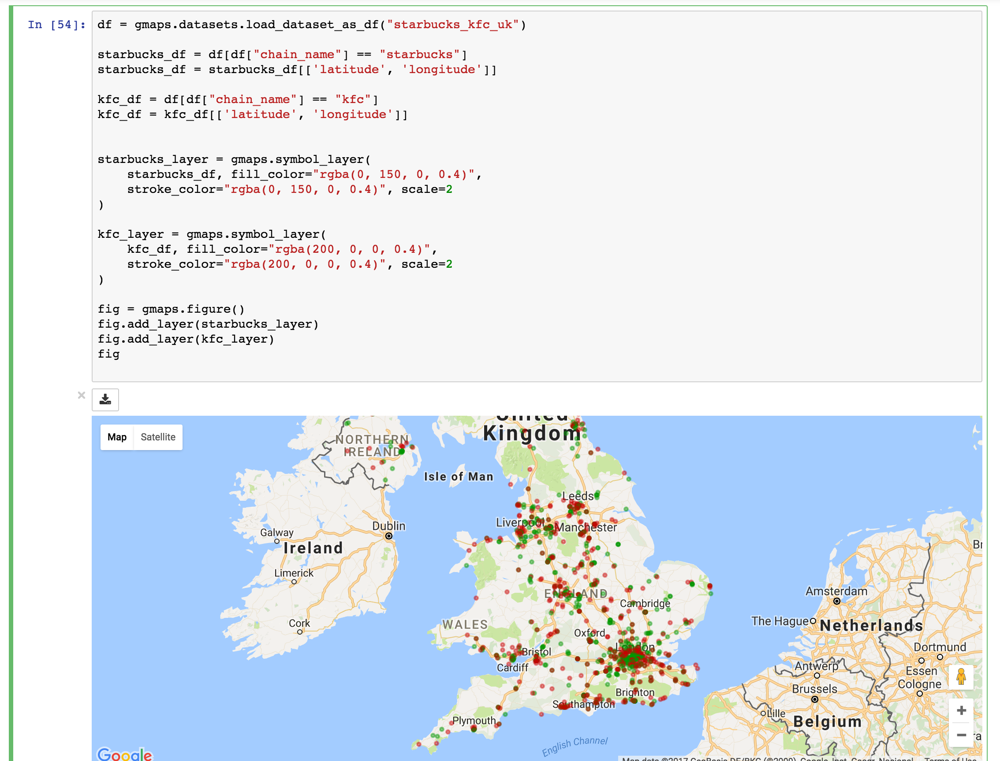

Dataset size limitations
++++++++++++++++++++++++

Google maps may become very slow if you try to represent more than a few thousand symbols or markers. If you have a larger dataset, you should either consider subsampling or use heatmaps.

GeoJSON layer
^^^^^^^^^^^^^

We can add GeoJSON to a map. This is very useful when we want to draw `chloropleth maps <https://en.wikipedia.org/wiki/Choropleth_map>`_.

You can either load data from your own GeoJSON file, or you can load one of the GeoJSON geometries bundled with `gmaps`. Let's start with the latter. We will create a map of the `GINI coefficient <https://en.wikipedia.org/wiki/Gini_coefficient>`_ (a measure of inequality) for every country in the world.

Let's start by just plotting the raw GeoJSON::

  import gmaps
  import gmaps.geojson_geometries
  gmaps.configure(api_key="AIza...")

  countries_geojson = gmaps.geojson_geometries.load_geometry('countries')

  fig = gmaps.figure()

  gini_layer = gmaps.geojson_layer(countries_geojson)
  fig.add_layer(gini_layer)
  fig

This just plots the country boundaries on top of a Google map.

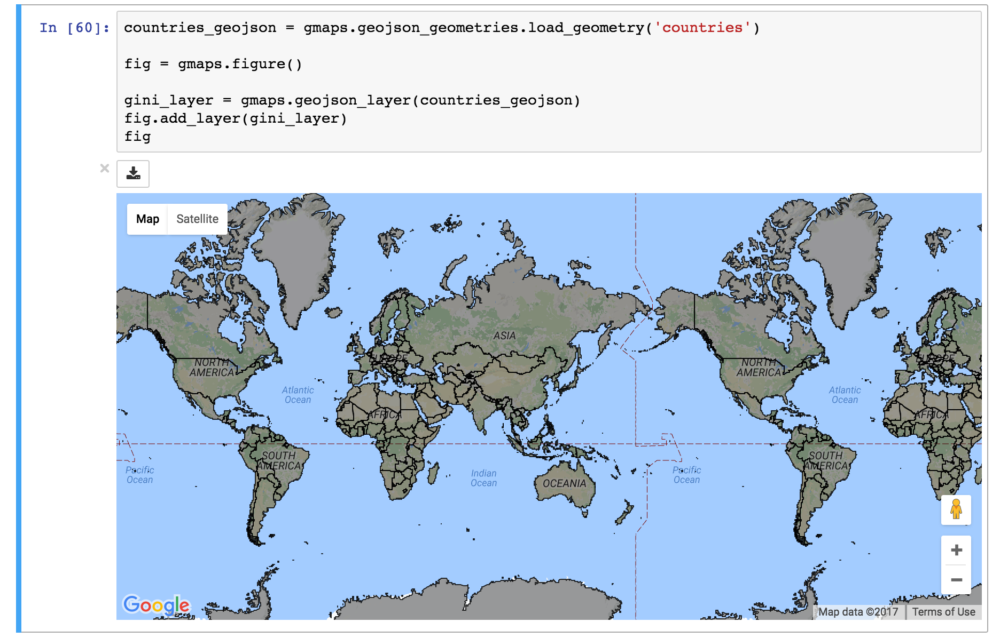

Next, we want to colour each country by a colour derived from its GINI index. We first need to map from each item in the GeoJSON document to a GINI value. GeoJSON documents are organised as a collection of `features`, each of which has the keys `geometry` and `properties`. For instance, for our countries::

  >>> print(len(geojson['features']))
  217 # corresponds to 217 distinct countries and territories
  >>> print(geojson['features'][0])
  {
    'type': 'Feature'
    'geometry': {'coordinates': [ ... ], 'type': 'Polygon'},
    'properties': {'ISO_A3': u'AFG', 'name': u'Afghanistan'}
  }

As we can see, `properties` encodes meta-information about the feature, like the country name. We will use this name to look up a GINI value for that country and translate that into a colour. We can download a list of GINI coefficients for (nearly) every country using the `gmaps.datasets` module (you could load your own data here)::

  import gmaps.datasets
  rows = gmaps.datasets.load_dataset('gini') # 'rows' is a list of tuples
  country2gini = dict(rows) # dictionary mapping 'country' -> gini coefficient
  print(country2gini['United Kingdom'])
  # 32.4

We can now use the ``country2gini`` dictionary to map each country to a color. We will use a Matplotlib `colormap <http://matplotlib.org/api/cm_api.html>`_  to map from our GINI floats to a color that makes sense on a linear scale. We will use the `Viridis <http://matplotlib.org/examples/color/colormaps_reference.html>`_ colorscale::

  from matplotlib.cm import viridis
  from matplotlib.colors import to_hex

  # We will need to scale the GINI values to lie between 0 and 1
  min_gini = min(country2gini.values())
  max_gini = max(country2gini.values())
  gini_range = max_gini - min_gini

  def calculate_color(gini):
      """
      Convert the GINI coefficient to a color
      """
      # make gini a number between 0 and 1
      normalized_gini = (gini - min_gini) / gini_range

      # invert gini so that high inequality gives dark color
      inverse_gini = 1.0 - normalized_gini

      # transform the gini coefficient to a matplotlib color
      mpl_color = viridis(inverse_gini)

      # transform from a matplotlib color to a valid CSS color
      gmaps_color = to_hex(mpl_color, keep_alpha=False)

      return gmaps_color

We now need to build an array of colors, one for each country, that we can pass to the GeoJSON layer. The easiest way to do this is to iterate over the array of features in the GeoJSON::

  colors = []
  for feature in countries_geojson['features']:
      country_name = feature['properties']['name']
      try:
          gini = country2gini[country_name]
          color = calculate_color(gini)
      except KeyError:
          # no GINI for that country: return default color
          color = (0, 0, 0, 0.3)
      colors.append(color)

We can now pass our array of colors to the GeoJSON layer::

  fig = gmaps.figure()
  gini_layer = gmaps.geojson_layer(
      countries_geojson, 
      fill_color=colors, 
      stroke_color=colors, 
      fill_opacity=0.8)
  fig.add_layer(gini_layer)
  fig

.. image:: _images/geojson-2.png

GeoJSON geometries bundled with Gmaps
+++++++++++++++++++++++++++++++++++++

Finding appropriate GeoJSON geometries can be painful. To mitigate this somewhat, `gmaps` comes with its own set of curated GeoJSON geometries::

  >>> import gmaps.geojson_geometries
  >>> gmaps.geojson_geometries.list_geometries()
  ['brazil-states',
  'england-counties',
  'us-states',
  'countries',
  'india-states',
  'us-counties',
  'countries-high-resolution']

  >>> gmaps.geojson_geometries.geometry_metadata('brazil-states')
  {'description': 'US county boundaries',
   'source': 'http://eric.clst.org/Stuff/USGeoJSON'}

Use the `load_geometry` function to get the GeoJSON object::

  import gmaps
  import gmaps.geojson_geometries
  gmaps.configure(api_key="AIza...")

  countries_geojson = gmaps.geojson_geometries.load_geometry('brazil-states')

  fig = gmaps.figure()

  geojson_layer = gmaps.geojson_layer(countries_geojson)
  fig.add_layer(geojson_layer)
  fig

New geometries would greatly enhance the usability of `jupyter-gmaps`. Refer to `this issue <https://github.com/pbugnion/gmaps/issues/112>`_ on GitHub for information on how to contribute a geometry.

Loading your own GeoJSON
++++++++++++++++++++++++

So far, we have only considered visualizing GeoJSON geometries that come with `jupyter-gmaps`. Most of the time, though, you will want to load your own geometry. Use the standard library `json <https://docs.python.org/3.5/library/json.html>`_ module for this::

  import json
  import gmaps
  gmaps.configure(api_key="AIza...")

  with open("my_geojson_geometry.json") as f:
      geometry = json.load(f)

  fig = gmaps.figure()
  geojson_layer = gmaps.geojson_layer(geometry)
  fig.add_layer(geojson_layer)
  fig

Drawing markers, lines and polygons
^^^^^^^^^^^^^^^^^^^^^^^^^^^^^^^^^^^

The `drawing layer` lets you draw complex shapes on the map. You can add markers,
lines and polygons directly to maps. Let's, for instance, draw the `Greenwich
meridian <https://en.wikipedia.org/wiki/Greenwich_Mean_Time>`_ and add
a marker on Greenwich itself::

  import gmaps
  gmaps.configure(api_key="AIza...")

  fig = gmaps.figure(center=(51.5, 0.1), zoom_level=9)

  # Features to draw on the map
  gmt_meridian = gmaps.Line(
      start=(52.0, 0.0),
      end=(50.0, 0.0),
      stroke_weight=3.0
  )
  greenwich = gmaps.Marker((51.3, 0.0), info_box_content="Greenwich")

  drawing = gmaps.drawing_layer(features=[greenwich, gmt_meridian])
  fig.add_layer(drawing)
  fig

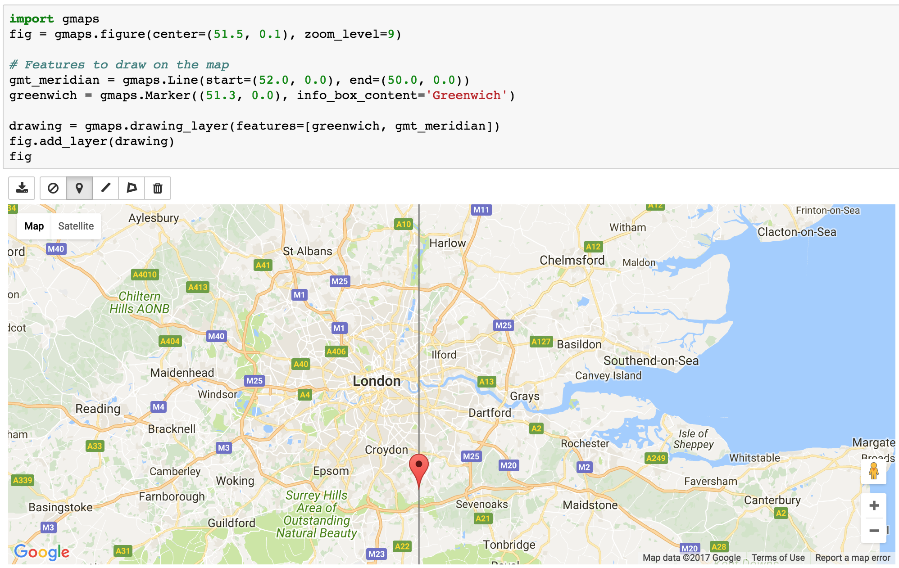

Adding the drawing layer to a map displays drawing controls that lets users add
arbitrary shapes to the map. This is useful if you want to react to user events
(for instance, if you want to run some Python code every time the user adds a
marker). This is discussed in the :ref:`reacting-to-user-actions` section.

To hide the drawing controls, pass ``show_controls=False`` as argument to the
drawing layer::

  drawing = gmaps.drawing_layer(
      features=[greenwich, gmt_meridian],
      show_controls=False
  )

Besides lines and markers, you can also draw polygons on the map. This is useful
for drawing complex shapes. For instance, we can draw the `London congestion
charge zone <https://en.wikipedia.org/wiki/London_congestion_charge>`_.
`jupyter-gmaps` has a built-in dataset with the coordinates of this zone::

  import gmaps
  import gmaps.datasets

  london_congestion_zone_path = gmaps.datasets.load_dataset('london_congestion_zone')
  london_congestion_zone_path[:2]
  # [(51.530318, -0.123026), (51.530078, -0.123614)]

We can draw this on the map with a :class:`gmaps.Polygon`::

  fig = gmaps.figure(center=(51.5, -0.1), zoom_level=12)
  drawing = gmaps.drawing_layer(
      features=[gmaps.Polygon(london_congestion_zone_path)],
      show_controls=False
  )
  fig.add_layer(drawing)
  fig 

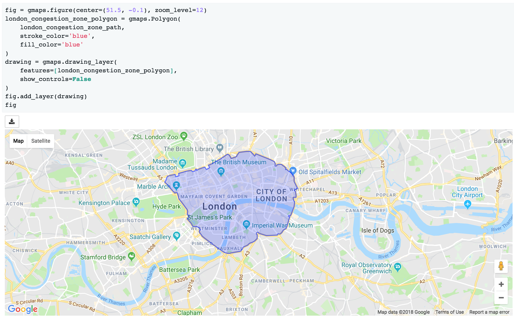

We can pass an arbitrary list of `(latitude, longitude)` pairs to
`gmaps.Polygon` to specify complex shapes.

See the API documentation for :func:`gmaps.drawing_layer` for an exhaustive list
of options for the drawing layer.

Directions layer
^^^^^^^^^^^^^^^^

`gmaps` supports drawing routes based on the Google maps `directions service <https://developers.google.com/maps/documentation/javascript/examples/directions-simple>`_. At the moment, this only supports directions between points denoted by latitude and longitude::

  import gmaps
  import gmaps.datasets
  gmaps.configure(api_key="AIza...")

  # Latitude-longitude pairs
  geneva = (46.2, 6.1)
  montreux = (46.4, 6.9)
  zurich = (47.4, 8.5)

  fig = gmaps.figure()
  geneva2zurich = gmaps.directions_layer(geneva, zurich)
  fig.add_layer(geneva2zurich)
  fig

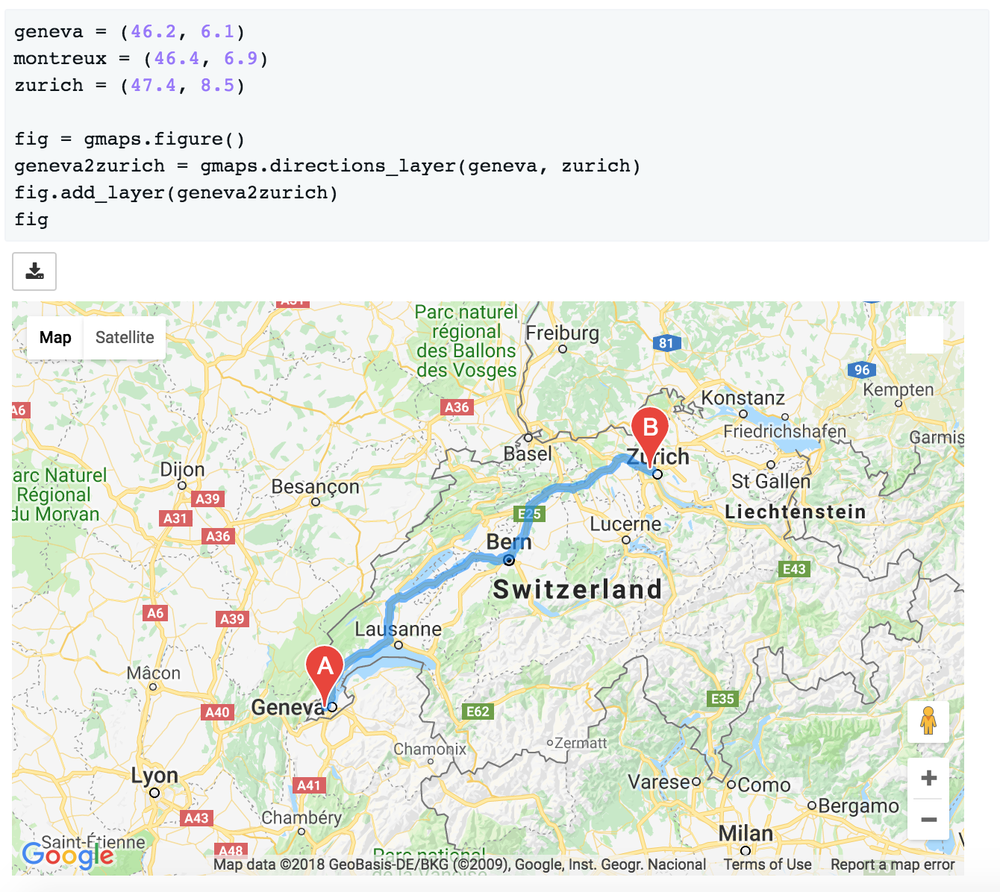

You can also pass waypoints and customise the directions request. You can pass up to 23 waypoints, and waypoints are not supported when the travel mode is ``'TRANSIT'`` (this is a limitation of the Google Maps directions service)::

  fig = gmaps.figure()
  geneva2zurich_via_montreux = gmaps.directions_layer(
          geneva, zurich, waypoints=[montreux],
          travel_mode='BICYCLING')
  fig.add_layer(geneva2zurich_via_montreux)
  fig

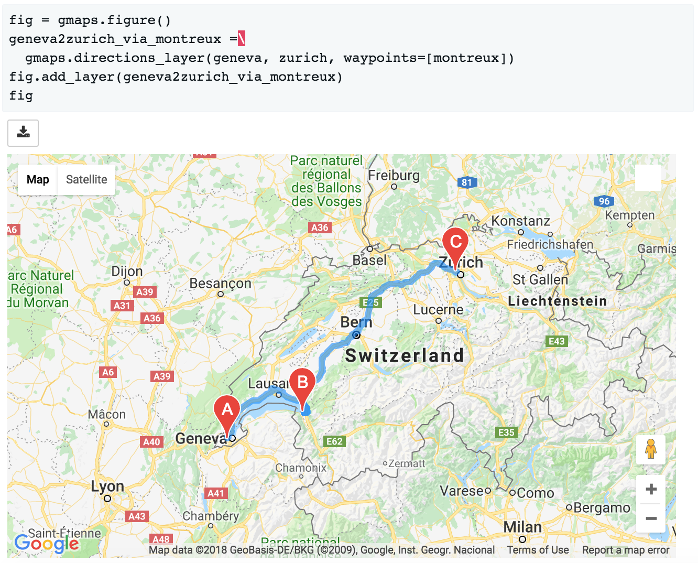

The full list of options is given as part of the documentation for the
:func:`gmaps.directions_layer`.

Bicycling, transit and traffic layers
^^^^^^^^^^^^^^^^^^^^^^^^^^^^^^^^^^^^^

You can add bicycling, transit and traffic information to a base map. For
instance, use :func:`gmaps.bicycling_layer` to draw cycle lanes. This will
also change the style of the base layer to de-emphasize streets which are not
cycle-friendly.

::

  import gmaps
  gmaps.configure(api_key="AI...")

  # Map centered on London
  fig = gmaps.figure(center=(51.5, -0.2), zoom_level=11)
  fig.add_layer(gmaps.bicycling_layer())
  fig

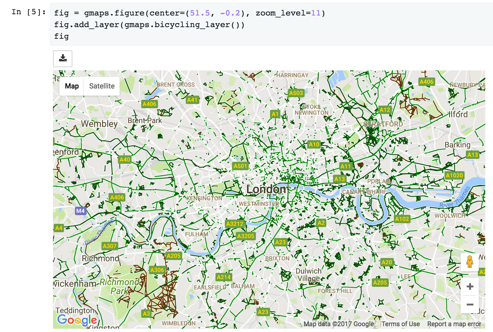

Similarly, the transit layer, available as :func:`gmaps.transit_layer`,
adds information about public transport, where available.

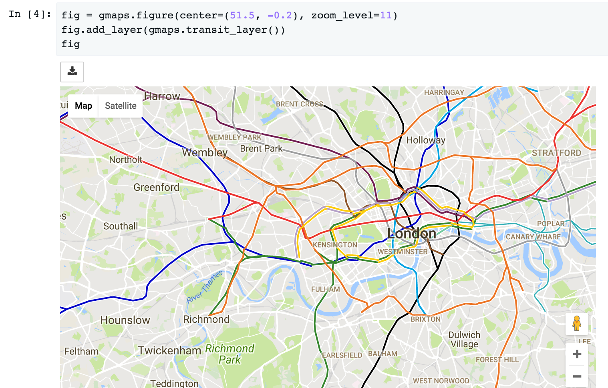

The traffic layer, available as :func:`gmaps.traffic_layer`, adds information
about the current state of traffic.

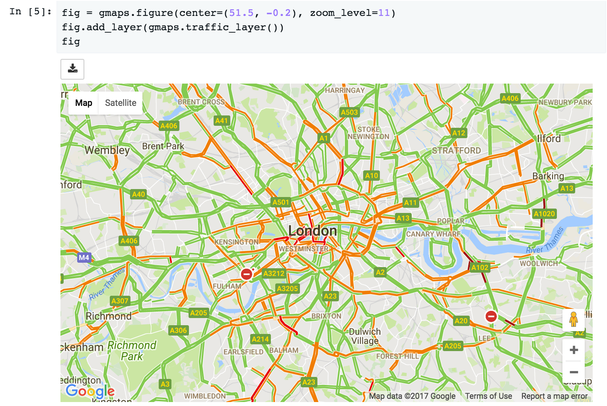

Unlike the other layers, these layers do not take any user data. Thus,
*jupyter-gmaps* will not use them to center the map. This means that,
if you use these layers by themselves, you will often want to center the
figure explicitly, using the ``center`` and ``zoom_level`` attributes.
